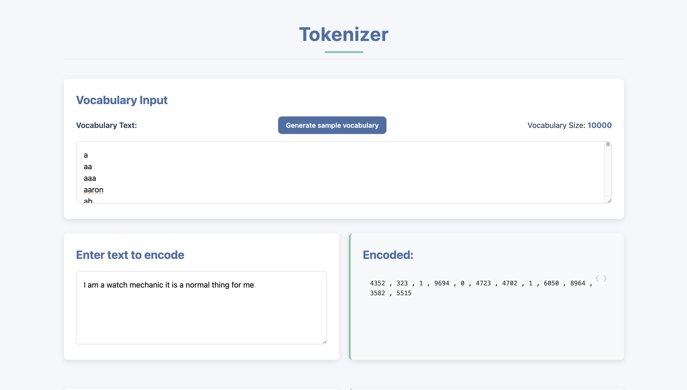
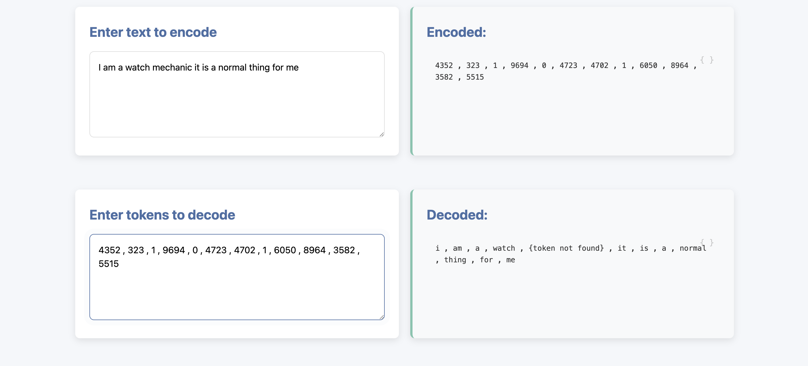

# Tokenizer

A simple tokenizer visualizer for processing text data into tokens to illustrate tokenization process in AI models for education purpose.

## Features

- Tokenizes text into words.
- Add your own vocabulory.
- Easy to understand.
- Can generate a sample vocabulary for educational purpose.
- Encoding and Decoding Implementation

## Installation

No need for any installation as it is simple website.

## Usage
Just clone the repository and open index.html file to run locally .
 
Or just directly visit [Tokenizer](kishanvadhiya.github.io/Tokenizer/) .

## Demo 
- Vocabulory definition

 

- Encode and decode tokens

## Contributing

1. Fork the repository.
2. Create a new branch: `git checkout -b feature-name`.
3. Commit your changes: `git commit -m 'Add feature'`.
4. Push to the branch: `git push origin feature-name`.
5. Open a pull request.

## License

This project is licensed under the MIT License. See the [LICENSE](LICENSE) file for details.

## Contact

For questions or feedback, please contact [kumarkishanvadhia@gmail.com](mailto:kumarkishanvadhia@gmail.com).
